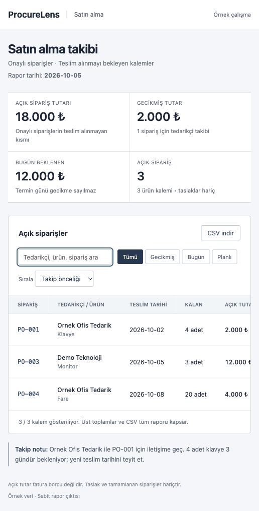
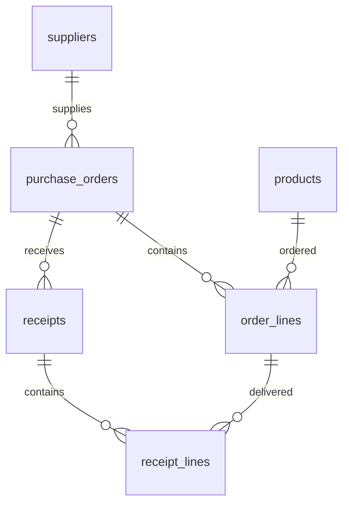

# ProcureLens — Satın Alma ve Teslimat Analizi

**Hangi sipariş gecikti, ne kadar ürün bekleniyor, önce hangi tedarikçi aranmalı?**
SQL ile satın alma akışını modelleyen, açık teslimatları ve gecikmeleri raporlayan
kişisel vaka çalışması. SQLite · SQL raporları · HTML/CSV · iş kuralları · 18 test.



[İş analizi ve sonuçlar](docs/case-study.md) · [Kabul senaryoları](docs/acceptance-tests.md) · [Örnek CSV](docs/demo/open-orders.csv)

## Raporu aç

`docs/demo/index.html` dosyasını tarayıcıda aç. Gecikmiş, bugün beklenen ve planlı
kalemleri filtrele, tedarikçi/ürün/sipariş ara ve tutara göre sırala. CSV indir bağlantısı aynı klasördeki dosyayı kullanır.
HTML çıktısı statiktir; filtreler tarayıcı içinde çalışır. Sunucu gerekmez.

Yeniden üretmek için:

```sh
python3 dashboard.py
python3 dashboard.py --as-of 2026-10-08 --output /tmp/procurelens-oct8
```

Varsayılan rapor tarihi 2026-10-05, sabit bir eğitim senaryosudur. Açık tutar
18.000 TL, gecikmiş tutar 2.000 TL, bugün beklenen tutar 12.000 TL'dir.
Temel laboratuvar verisine `demo.sql` ile ayrı sunum senaryosu eklenir.

## Eğitim laboratuvarı

Satın alma ve mal kabul sürecini öğrenmek için SQL odaklı kişisel proje.
SQLite, temel ilişkisel veri modeli ve iş süreçleri üzerine çalışır.
Bir müşteri uygulaması veya tam kapsamlı ERP değildir. Tüm veriler hayalidir.

## Çalıştırma

Python 3.10+ gerekir; harici paket kurulumu yoktur. Proje klasöründe:

```sh
python3 run.py
python3 -m unittest -v
```

İlk komut geçici bellekte temiz bir örnek oluşturur, yedi raporu yazdırır ve kapanır.
Her çalıştırmada aynı sonucu verir. Kalıcı SQLite dosyası istersen:

```sh
python3 run.py --save practice.db
```

Mevcut dosyanın üzerine yazılmaz. Veritabanı dosyaları Git'e dahil edilmez.

## İş senaryosu

10 klavye (500 TL/adet) ve 5 fare (200 TL/adet) sipariş edilir. Toplam 6.000 TL.
Sipariş onaylanır; ilk teslimatta 6 klavye ve 5 fare gelir.

Beklenen raporlar:
- Stok: klavye 6, fare 5, monitör 0.
- Açık sipariş: 4 klavye.
- Sipariş 1: KISMI_TESLIM. Sipariş 2: TASLAK.
- Hiç sipariş verilmeyen tedarikçi: Yeni Tedarikci.

Sipariş miktarı stok değildir. Stok yalnızca gerçekleşen mal kabulünden hesaplanır.
Bu sürümde stok çıkışı olmadığından stok, toplam girişe eşittir.

## Dosyalar ve öğrenme sırası

1. `docs/requirements.md`: ihtiyaç ve iş kuralları.
2. `schema.sql`: altı ilişkili tablo, anahtarlar ve kısıtlar.
3. `seed.sql`: INSERT ile hayali ana veriler ve taslak siparişler.
4. `workflow.sql`: UPDATE, onay ve kısmi teslimat.
5. `reports.sql`: SELECT, WHERE, JOIN, GROUP BY, HAVING, SUM, NULL, CASE.
6. `docs/learning.md`: alıştırmalar ve görüşme hazırlığı.
7. `guards.sql`: ileri seviye, isteğe bağlı trigger okuması.
8. `risk.sql`: tarih parametresi, gecikme hesabı ve kalem bazında teslimat toplamı.

`dashboard.py` SQL raporunu HTML ve CSV'ye dönüştürür; `templates/report.html`
görsel sunum şablonudur. `.github/workflows/tests.yml` GitHub'a yüklenince
testleri çalıştıracak yapılandırmadır; henüz uzak ortamda çalıştırılmış değildir.

`run.py` yalnızca SQL dosyalarını çalıştırır; projenin öğrenme odağı Python değildir.
`test_project.py` olumlu ve olumsuz iş senaryolarını sınar.

## Veri ilişkileri



## Tasarım kararları

- Fiyatlar ondalık yuvarlama sorunlarını azaltmak için tam kuruş tutulur.
- Para birimi TRY, ürün miktarı tam adettir.
- Stok ve teslimat durumu sorguyla hesaplanır; ayrı kopyalar tutulmaz.
- Tek sipariş için bir teslimat referansı tekrar kullanılamaz.
- Onaylı siparişler ve teslimat geçmişi değiştirilemez; iade akışı kapsam dışıdır.
- Teslimat başlığı ve kalemleri transaction içinde kaydedilir. SQL hatasında
  istemci ROLLBACK yapmalıdır; Python yardımcı ve testleri bunu yapar.
- SQLite bağlantısında `PRAGMA foreign_keys = ON` gereklidir.
- Kimlik doğrulama, kullanıcı yetkisi, vergi, fatura, ödeme ve çoklu depo yoktur.

## Şeffaflık

Başlangıç kodu ve öğrenme materyali yapay zekâ yardımıyla hazırlanmıştır.
Kişisel uygulama çalışmaları ve öğrenme durumu `docs/learning.md` içinde takip edilir.
Gerçek müşteri deneyimi, üretim kullanımı veya bağımsız geliştirme iddiası içermez.
